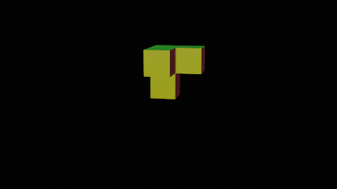

# FudgeCraft Idee

## Spielidee

1. Es ist der Base Würfel gegeben der auf jedem Face eine andere Farbe besitzt. 
2. Nun kommen aus unterschiedlichen Richtungen nach und nach verschiedenen Objekte die von der Form her nach Tetris Fragmenten erinnern sollen.
3. Die Fragmente müssen nacheinander um die Base positioniert werden. 
4. Bei der Positionierung der Fragmente muss aufgepasst werden dass die Flächen der Fragmente genau in die gleiche Richtung schauen wie die Flächen der Base. 
6. Zur Positionierung müssen die Fragmente teilweise Rotiert werden. (In meiner Demo hab ich nicht dargestellt das sie Teilweise auch noch Bewegt werden müssen an die richtige Richtung.)
7. Das Ziel soll es sein einen 6X6X6 Würfel aufzubauen.

siehe Prototype

8. Wenn der Würfel korrekt zusammengebaut ist, Rotiert er sich um seine eigene Achse (in meinem bsp. Rotiert sich die Kamera kurz um die Achse)
9. Danach verschwindet der Fertige Würfel und an die Base erscheint wieder aber dieses mal in einer abgeänderten Form

## Steuerung

Pfeiltasten -> Base lässt sich um die eigene Achse Rotieren
WASD -> Fragmente bewegen sich auf der Horizontale mit den Tasten W & S nach hinten oder Vorne und mit A & D nach Rechts oder Links

Leerzeichen -> Fragmente lassen sich um 90° Drehen auf ihrer Z Achse.

## Score

Es könnte vlt noch ein Score eingebunden werden der Pro Tasteneingabe von einem gewissen Startzahl immer paar Punkte abzieht.

## Notfall Idee

Falls die Idee zu komplex ist, könnte man an der Grundidee Festhalten aber daraus irgendwie ein Puzzle Game machen wie z.B. der Somawürfel. 
